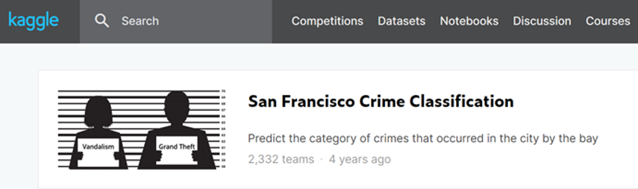

# [kaggle][学习向]搭建项目与下载数据

## Kaggle竞赛简介

Kaggle是由联合创始人、首席执行官Anthony Goldbloom于2010年在墨尔本创立的，主要为开发商和数据科学家提供举办机器学习竞赛、托管数据库、编写和分享代码的平台。后被Google收购

里面有丰富的数据（datasets）、教学资源（notebook、discussion）、运算资源（kernels），适合初学者（比如我）进行学习

废话少说，让我们开始

## 选择一个数据集

注册账号啥的自行处理好了，唯一的麻烦是需要通过Google的验证，所以你懂的

这回我选择的是一个不太出名的数据集（其实是老师推荐的）——[San Francisco Crime Classification](https://www.kaggle.com/c/sf-crime)

