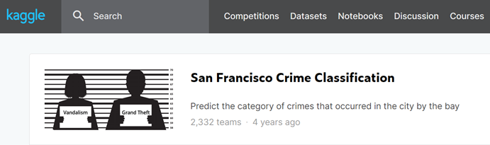

# [旧金山犯罪分类预测模型研究]1、项目搭建

## Kaggle竞赛简介

Kaggle是由联合创始人、首席执行官Anthony Goldbloom于2010年在墨尔本创立的，主要为开发商和数据科学家提供举办机器学习竞赛、托管数据库、编写和分享代码的平台，后被Google收购

里面有丰富的数据（datasets）、教学资源（notebook、discussion）以及不算太给力的运算资源（kernels），适合初学者（比如我）进行学习

废话少说，让我们开始

## 选择一个数据集

注册账号啥的自行处理好了，唯一的麻烦是需要通过Google的验证，所以你懂的

这回我选择的是一个不太出名的数据集（其实是老师推荐的）——[San Francisco Crime Classification](https://www.kaggle.com/c/sf-crime)



按提示下载数据，根据Kaggle官方介绍，这个数据集是由旧金山市中央数据交换所（SF OpenData）提供的，包括来自旧金山所有街区近12年（2003年至2015年）的犯罪报告

官方给出的训练集（train.csv）样例如下：


官方给出的测试集（test.csv）样例如下：


另外还有一个sampleSubmission.csv文件，是提交文件的样例，图略

## 搭建一个项目空间

用你的邮箱地址申请一个gitee（github）账号

把账号的用户名、邮箱地址录入git：

```
git config --global user.name "xxxx"
git config --global user.email "xxx@xxx.com"
#--global会使整个电脑用户下的git都使用这个用户名
#可以用--local给单个项目设定用户名
```

然后为你的邮箱地址绑定ssh，不会的地方可以参考[如何在一台电脑上同时使用Gitee（码云）和Github？](https://segmentfault.com/a/1190000020127413)，我们选择性的绑定一个网站的就行

在gitee（github）上开一个resposity（仓库），并初始化


然后记录下ssh的clone地址


切换到你想要建立项目目录的上级目录，打开终端

```
git clone git@gitee.com:xxxx/xxxx.git #你刚才复制下来的那段URL
```

你的项目被从云端同步到了主机（如果没有绑定ssh，中间可能会让你提供账号密码），切换到此目录

```
git init #会提示你已经初始化了，但再来一次也无妨
#新建一个测试的文件，比如：helloworld.md啥的，里面随便写点啥
git status #会提示新增文件helloworld.md
git add . #将新增文件helloworld.md加入仓库
git commit -m "xxx" #完成一次提交
git push #同步到云端，如果报错，加-f参数强制上传，不过慎用-f
#后面4个命令会反反复复的用，记下来
```

至此，我们完成了第一次提交，往后我们每一次完成阶段性的任务，我们就提交一次

因为我们最后的结果会扔到kernel上跑出来，所以我们项目的结构应该参考一下kernel的结构，kernel的文件结构如下：（暂时不需要知道这个图片是怎么来的，后面会提到）


所以，我们应该在我们的项目目录下新建两个目录，/input和/working，另外，我们想要源代码文件和输出文件相隔离，再建一个目录/src，/input下新建sf-crime文件夹，把下载下来的数据（三个.zip，不用解压，pandas可以直接读zip）放里面

目录树如下：（PS：应该还有gitee自带的.git、.gitee、README.md等文件）


现在项目目录成功完成布局
