# [旧金山犯罪分类预测模型研究]2、数据的可视化分析


## 初窥数据集


在上一篇中，我们对项目的目录完成了布局，并将包含数据的csv表格放在了/input/sf-crime文件夹下。


然后，切换到目录/src，用pandas库读取数据：


```python
import pandas as pd
train_data = pd.read_csv('../input/sf-crime/train.csv.zip',parse_dates=['Dates'])
test_data = pd.read_csv('../input/sf-crime/test.csv.zip',parse_dates=['Dates'])
```

查看两个数据集的基本信息：

```python
train_data.info()
test_data.info()
```

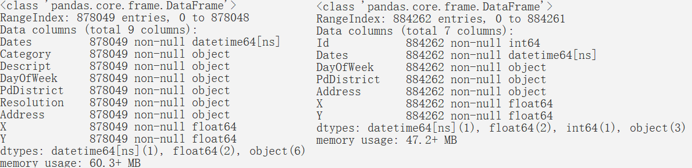

显示前五行数据：


```python
train_data[:5]
test_data[:5]
```

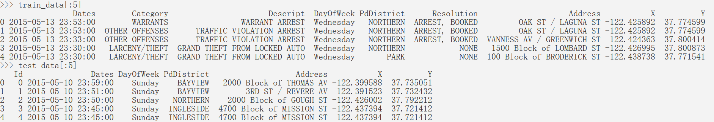

可以看到，训练集的数据有9列，分别是时间（Dates），犯罪类型（Category），描述（Descript），星期几（DayOfWeek），辖区（PdDistrict），解决情况（Resolution），地点（Address），经纬度（X、Y），而测试集的数据有7列，分别是标识号（Id），时间（Dates），星期几（DayOfWeek），辖区（PdDistrict），地点（Address），经纬度（X、Y）。

显然，测试集的标识号（Id）一列对于模型的建立毫无帮助，抛弃此列；其次，由于根据训练集训练出来的模型还是用于测试集上，训练集应当抛弃描述（Descript）和解决情况（Resolution）两列；最后，训练集的犯罪类型（Category）一列即是训练集的标签。

分析余下六列的情况：时间（Dates）包含了年、月、日、小时、分钟和秒，而且可能还隐含有节日、季度、白天、黑夜，是重要的参数；星期几（DayOfWeek）应该也会对犯罪类型产生影响，暂时保留；辖区（PdDistrict）之间的治安情况有所差异，是重要的参数；地点（Address）与辖区（PdDistrict）、经纬度（X、Y）显示的信息有重合，且没法进行独热编码，但观察到，存在高频单词“block”（街区），猜想可能街道内与街道外存在差异，暂时保留；经纬度（X、Y）应当作为参数。到此，完成了对数据情况的定性分析，下面将对训练集的内容进行可视化分析。


## 可视化分析

导入matplotlib、seaborn库，开始编写程序：


```python
import seaborn as sns
import matplotlib.pyplot as plt
%matplotlib inline

cate_group = train_data.groupby(by='Category').size()
cat_num = len(cate_group.index)
cate_group.sort_values(ascending=False,inplace=True)
cate_group.plot(kind='bar',logy=True,color=sns.color_palette('coolwarm',cat_num))
plt.title('No. of Crime types',fontsize=20)
plt.show()
```


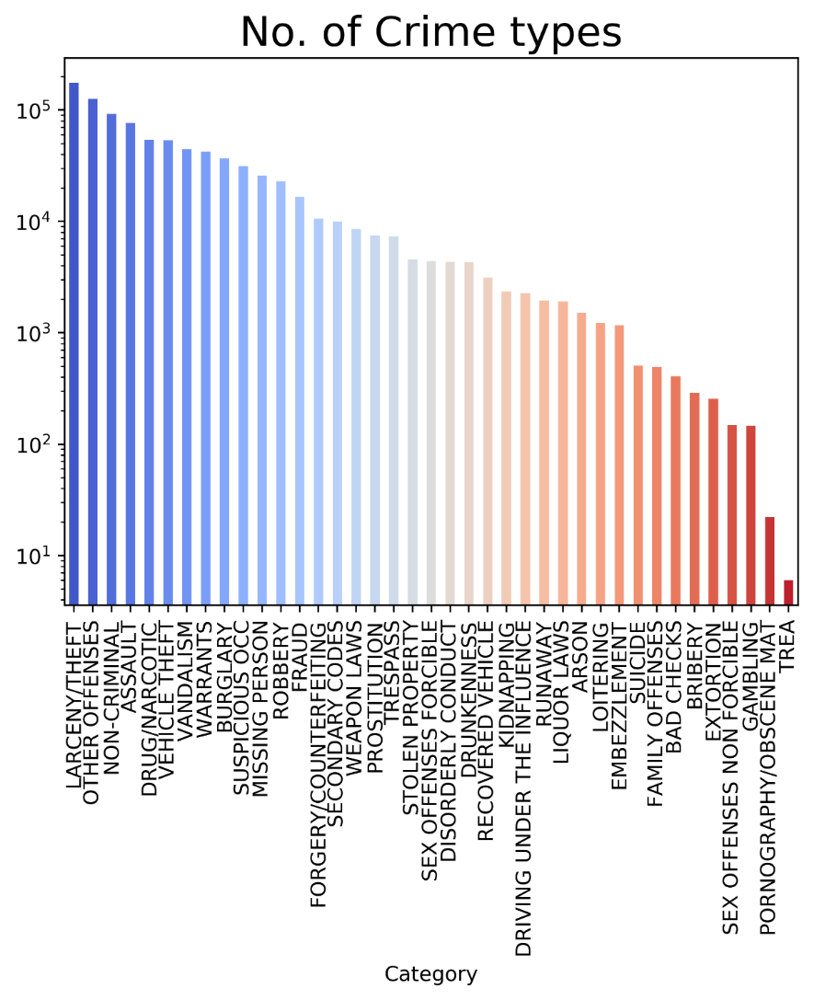


这就是旧金山市，2003年至2015年，各犯罪种类数量的直方图。可以看出各种犯罪种类数量存在明显的区别，而本项目所要做的就是，用时间和空间作为参数，定量的描述这个区别。

从上图可知，虽然数量下降的曲线较平缓，但是由于纵坐标的指数级的，可见数量较多的犯罪类型占比较大，旧金山市的犯罪集中在靠前的几类中。

继续编写程序，得到折线图（左）：


```python
train_data['date'] = pd.to_datetime(train_data['Dates'])
train_data['year'] = train_data.date.dt.year
train_data['month'] = train_data.date.dt.month
train_data['day'] = train_data.date.dt.day
train_data['hour'] = train_data.date.dt.hour
train_data['minute'] = train_data.date.dt.minute

year_group = train_data.groupby('year').size()
plt.plot(year_group,'ks-')
#2015年不完整
plt.xlabel('year')
plt.title('No. of crimes by year',fontsize=20)
plt.show()
```


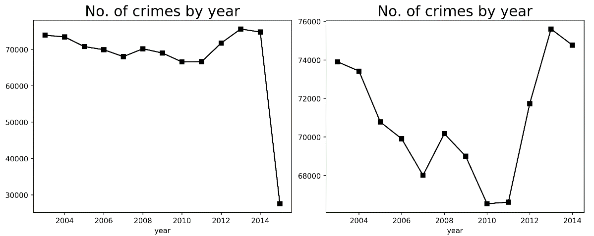


此图显示的是犯罪数量与年份的关系，但是2015年出现了一次暴跌，根据观察，发现2015年的记录只到3月份，暂时排除2015年的记录，修改程序得到新的折线图（右）


```python
plt.plot(year_group.index[:-1],year_group[:-1],'ks-')
```

从上两图可知，在2010年之前旧金山市的犯罪数量基本上呈现递减趋势，2010年之后数量激增，年份这个时间因素有效的影响了犯罪发生的数量，猜想可作为模型参数。

考虑到机器学习能有效的拟合函数，不需要通过进一步的统计分析来描述各种犯罪与年份的关系，只需要确定年份能左右犯罪数量，就可以作为训练集特征。

根据类似于年的程序，得到月与犯罪的折线图：

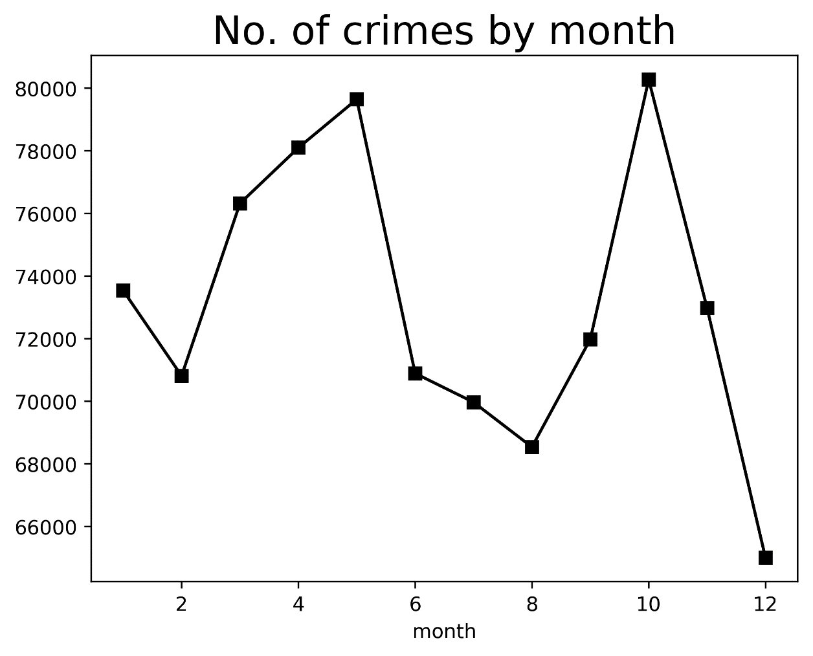


从上图可知，案件高发期是一年中的5月和10月，并且12月份出现了低谷。与年份同样的理由，月份可以作为训练集特征。

另外，根据美国习俗，美国新年是1月1日，12月25日是对美国人具有重大意义的圣诞节，可以猜测，1月的反常数值和12月的低谷是由美国重大节日导致的。类比中国的情况，中国新年期间的犯罪种类与其他时间有较大区别。猜测美国新年存在类似情况。

编写程序得到折线图进行验证：


```python
top10 = list(cate_group.index[:10])
tmp = train_data[train_data['Category'].isin(top10)]
mon_g = tmp.groupby(['Category','month']).size()
mon_g = mon_g.unstack()
for i in range(10):
    mon_g.iloc[i] = mon_g.iloc[i]/mon_g.sum(axis=1)[i]
mon_g.T.plot(figsize=(12,6),style='o-')
plt.show()
```


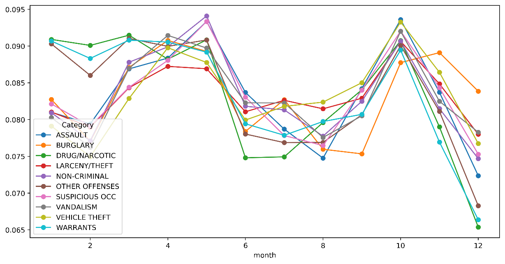


可以确定，1月、2月是特殊的，应当作为一个单独的训练集特征。

按照与年份、月份类似的方法，绘出天、小时、分钟（秒在这个数据集全部都是0）的折线图：

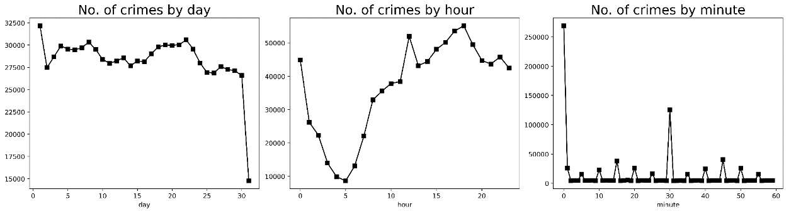


由上述三图，可以判断，天和小时应当作为训练集特征，而分钟呈现出无规律性，猜测，一方面是因为分钟的确不太影响犯罪类型，另一方面是因为美国警察在统计数据的时候没有实事求是，倾向于在分钟部分填写，00分（整点）、30分（半点）及5分钟的倍数。据此，此数据既不可靠又与类型没明显关系，需要排除。

另外，按照中国的经验，白天和黑夜对犯罪类型存在影响，猜测美国存在类似情况，编写程序得到折线图进行验证：


```python
top6 = list(cate_group.index[:6])
tmp = train_data[train_data['Category'].isin(top6)]
hou_g = tmp.groupby(['Category','hour']).size()
hou_g = hou_g.unstack()
hou_g.T.plot(figsize=(12,6),style='o-')
plt.show()
```


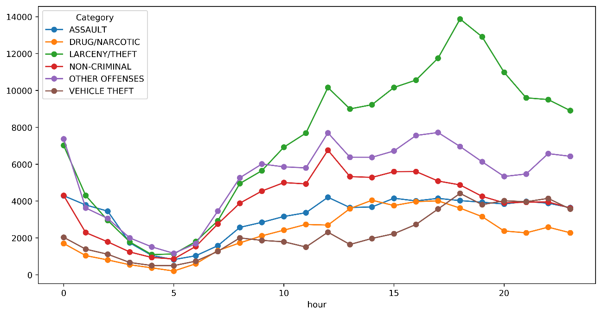


在图中，猜测得到了验证，盗窃罪在半晚先是激增，然后下降，袭击罪则无此特点，18点之后是特殊的，应当作为一个单独的训练集特征。

星期几同样会影响犯罪类型，编写程序，得到折线图：


```python
wkm = {
    'Monday': 0,
    'Tuesday': 1,
    'Wednesday': 2,
    'Thursday': 3,
    'Friday': 4,
    'Saturday': 5,
    'Sunday': 6
}
train_data['DayOfWeek'] = train_data['DayOfWeek'].apply(lambda x: wkm[x])
tmp = train_data[train_data['Category'].isin(top6)]
wee_group = tmp.groupby(['Category', 'DayOfWeek']).size()
wee_group = wee_group.unstack()
wee_group.T.plot(figsize=(12, 6), style='o-')
plt.xticks([0, 1, 2, 3, 4, 5, 6],
           ['Mon', 'Tue', 'Wed', 'Thur', 'Fri', 'Sat', 'Sun'])
plt.show()
```


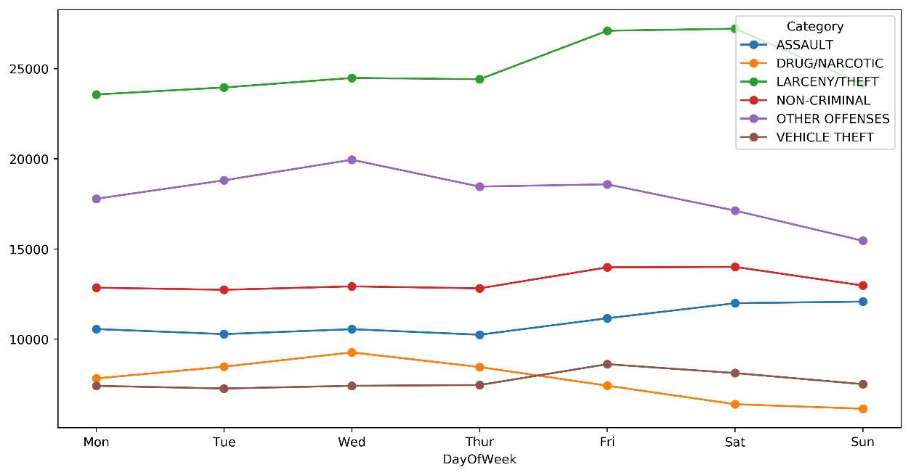


由上图所示，主要的五种犯罪里面（OTHER OFFENSES其他罪行除外），除了毒品类犯罪外，都在周五、周六有明显上升，而毒品类犯罪，周末呈现下降趋势。

据此得到两个训练集特征，一是星期几，二是是否是周五、周六。

编写程序，得到直方图：


```python
dis_group = train_data.groupby(by='PdDistrict').size()
dis_num = len(dis_group.index)
dis_group.sort_values(ascending=False, inplace=True)
dis_group.plot(kind='bar',
               fontsize=10,
               color=sns.color_palette('coolwarm', dis_num))
plt.title('No. of crimes by district', fontsize=20)
plt.show()
```


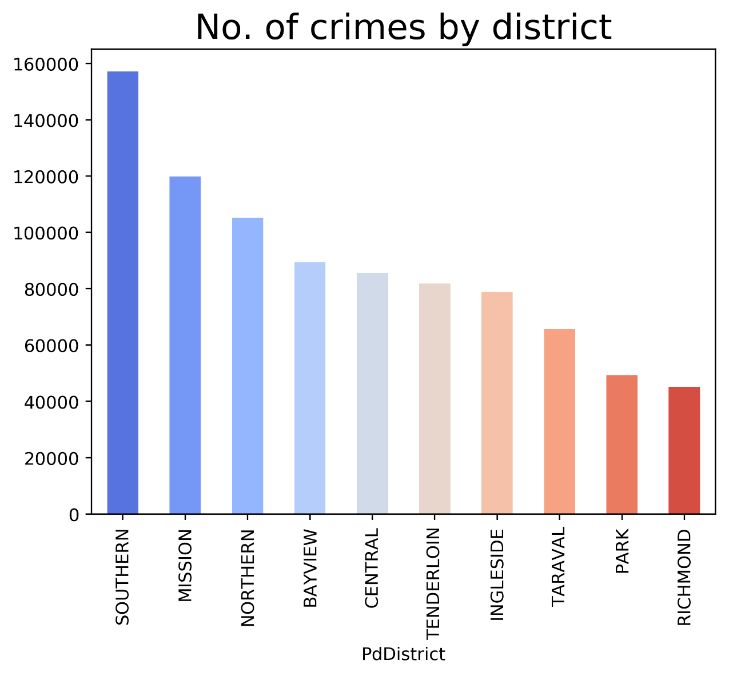


由此图可以看出，辖区对犯罪数量影响明显，应当作为训练集特征。

观察训练集，发现Address里存在关键词“block（街区）”，街道一般靠近住宅区，而非街道一般靠近商业区，猜测，Address里是否存在block会影响犯罪类型。

编写程序，得到直方图：


```python
train_data['block'] = train_data['Address'].apply(
    lambda x: 1 if 'block' in x.lower() else 0)
tmp = train_data[train_data['Category'].isin(top10)]
blo_group = tmp.groupby(['Category', 'block']).size()
blo_group.unstack().T.plot(kind='bar', figsize=(12, 6), rot=45)
plt.xticks([0, 1], ['no block', 'block'])
plt.show()
```


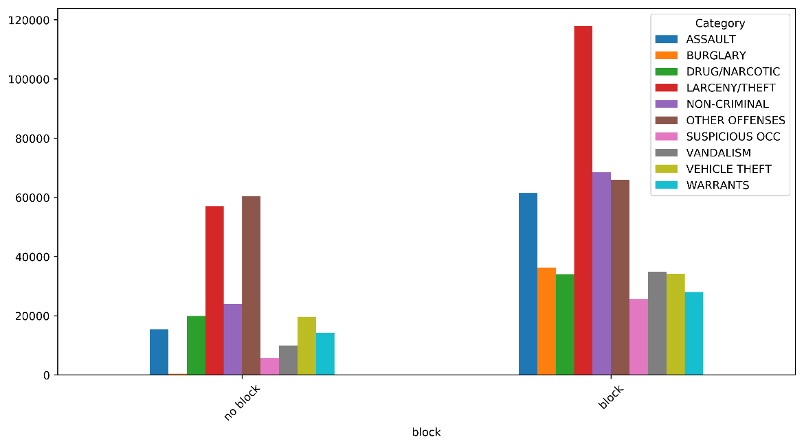


可以观察到，block内各种犯罪数量普遍增长，且入室盗窃罪等几种犯罪的增幅远高于其他类型，可以得到结论，是否位于block（街区）是训练集特征。

编写程序：


```python
xy_group = pd.concat([train_data.X, train_data.Y], axis=1)
xy_group = xy_group.drop(xy_group[xy_group.Y > 50].index)
#存在66个（-120.5,90.0）点
xy_group.plot(kind='scatter', x='X', y='Y')
plt.xlabel('X')
plt.ylabel('Y')
plt.show()
```

在编写过程中发现，训练集内存在66个坐标为（-120.5,90.0）的点，经查询，发现这些点不在旧金山市内，应该是错误数据，所以抛弃这些点，然后得到散点图：

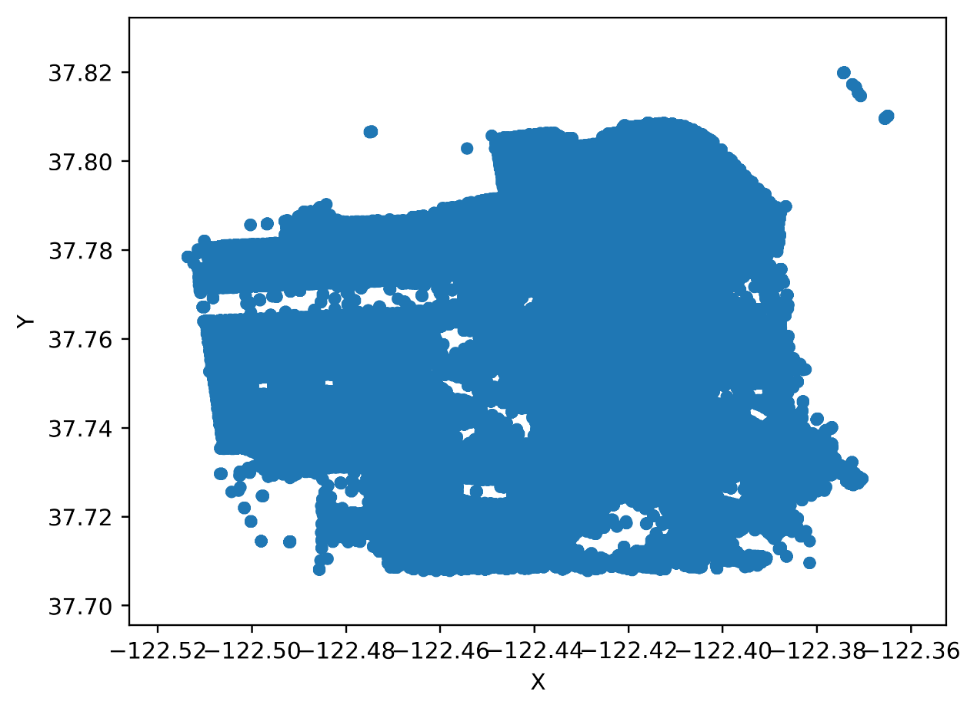


进一步从散点图的特征来编写热力图生成的程序：


```python
img = plt.imread('../input/sf-crime/map.png')
#PS:此图从openstreetmap截下来的
dpi = 100
height, width, depth = img.shape
plt.figure(figsize=(width / dpi, height / dpi))
plt.imshow(img)
plt.axis('off')
plt.show()
```

```python
plt.figure(figsize=(width / dpi, height / dpi))
plt.hist2d(xy_group.X.values, xy_group.Y.values, bins=40, cmap='Reds')
plt.show()
```

拼接两图，得到：

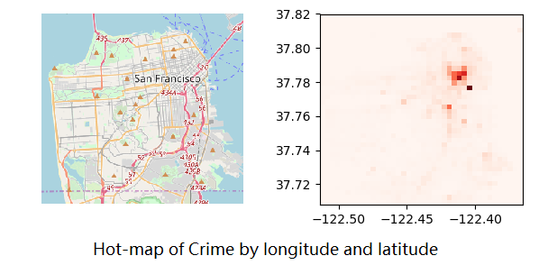

根据此热力图可以看出，经纬度能够影响犯罪类型，但是考虑到里面存在着错误数值，作为训练集特征还需要进一步加工。

至此，完成了对参数的选取，选择了年份、月份、新年（是否是1月、2月）、天、小时、黑夜（是否是18点之后）、星期几、周末（是否是周五、周六）作为时间参数；选择了辖区、街区（是否存在block）、经纬度作为空间参数。

诚然，如果进一步分析应该还可以提取出新的参数，例如：将Address进行word2vec操作，但是神经网络的训练时间被输入的复杂度所影响，引入词向量会大幅增加训练时间，并且，在街区这个参数被选取之后，这个时间增长不太值得。又例如：对经纬度运用聚类算法，但是考虑到经纬度的数据存在错漏，运用聚类算法增加新的参数，这个参数的正确性值得考量，所以，应该对经纬度这个特征进行削弱，而不是增强。再例如：在分析过程中可以发现，一个小时的前半个小时的犯罪数量与后半个小时的犯罪数量存在显著差异，但这是有违直觉的，加上分钟很有可能是存在错漏的数据，所以不使用这个特征。

综上，目前选取的12个特征是权衡之后的较优选择。
