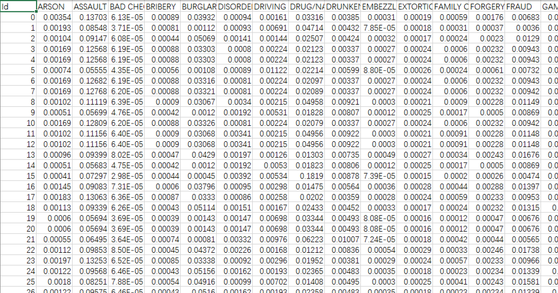

# [旧金山犯罪分类预测模型研究]5、单层神经网络

在这一篇中，我们将搭建一个简单的神经网络，并在后一篇中对这个神经网络进行改进，下面开始编写程序

## 线性回归

导入所需要使用的库：


```python
import pandas as pd
import numpy as np
import torch
from torch import nn
```

导入上一篇中处理好的训练集的特征和标签：


```python
train_features = np.load('./data/train_features.npy')
train_labels = np.load('./data/train_labels.npy')
train_features = torch.tensor(train_features, dtype=torch.float)
train_labels = torch.tensor(train_labels)

num_inputs = 21
num_outputs = 39
```

粗略设置超参数：


```python
num_epochs = 5
batch_size = 32
lr = 0.1
```

### 小批量读取数据

运用torch框架的DataLoader将训练集的特征和标签进行包装：


```python
dataset = torch.utils.data.TensorDataset(train_features, train_labels)
train_iter = torch.utils.data.DataLoader(dataset, batch_size, shuffle=True)
```

### 定义模型

定义一个单层的、线性的模型net：


```python
net = nn.Sequential()
net.add_module('Dense',nn.Linear(num_inputs, num_outputs))
# torch框架会自动初始化模型参数
#可以用如下代码查看参数
#for parame in net.named_parameters():
#    print(parame)
```

### 定义损失函数


```python
loss = nn.CrossEntropyLoss()
# torch框架中CrossEntropyLoss自带Softmax运算，所以网络部分没有Softmax层
```

### 定义优化函数


```python
optimizer = torch.optim.SGD(net.parameters(), lr=lr)
```

### 训练模型


```python
for epoch in range(num_epochs):
    train_l_sum, train_acc_sum, n = 0.0, 0.0, 0
    for X, y in train_iter:
        y_hat = net(X)
        l = loss(y_hat, y).sum()
        optimizer.zero_grad()
        l.backward()
        optimizer.step()
        train_l_sum += l.item()
        train_acc_sum += (y_hat.argmax(dim=1) == y).sum().item()
        n += y.shape[0]
    print('epoch %d, loss %.4f, train acc %.3f'
          % (epoch + 1, train_l_sum / n, train_acc_sum / n))
```

得到如下输出：

epoch 1, loss 0.0802, train acc 0.229

epoch 2, loss 0.0797, train acc 0.230

epoch 3, loss 0.0796, train acc 0.230

epoch 4, loss 0.0796, train acc 0.229

epoch 5, loss 0.0796, train acc 0.230


从代码层面可以很轻松的看出，这个模型还存在很大的改进空间，但在改进此模型之前，先检验一下，这个简单的模型的效果。

## 使用模型进行预测

### 增加Softmax层


```python
net.add_module('Softmax', nn.Softmax(dim=-1))
```

### 计算测试集并得到输出

导入处理好的测试集的特征：


```python
test_features = np.load('./data/test_features.npy')
test_features = torch.tensor(test_features, dtype=torch.float)
```

计算得到预测结果：


```python
testResult = net(test_features).detach().numpy()
```

读取sampleSubmission的格式：


```python
sampleSubmission = pd.read_csv('../input/sf-crime/sampleSubmission.csv.zip')
Result_pd = pd.DataFrame(testResult,
                         index=sampleSubmission.index,
                         columns=sampleSubmission.columns[1:])
```

将预测结果写入sampleSubmission(v0.1).csv：


```python
Result_pd.to_csv('../working/sampleSubmission(v0.1).csv', index_label='Id')
```

sampleSubmission(v0.1).csv样例如下：



测试集误差：

