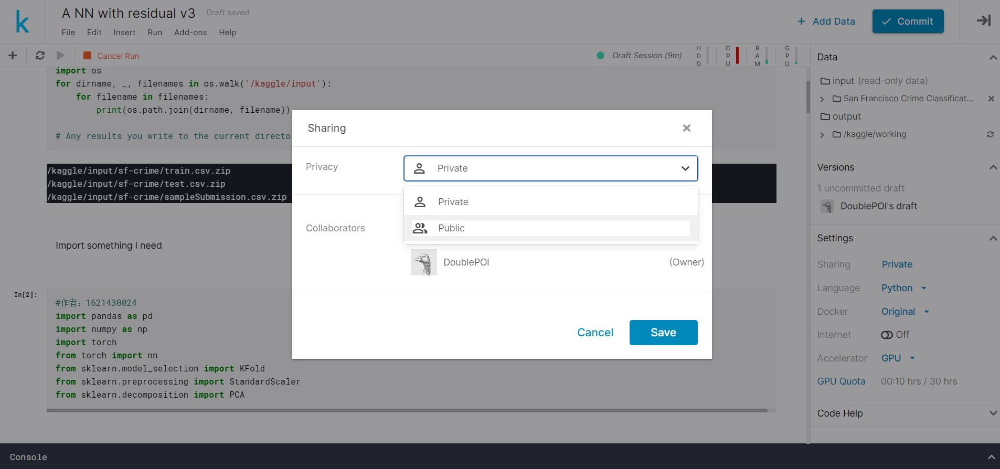

# [旧金山犯罪分类预测模型研究]7、Kernels计算资源的使用

这一篇里如何介绍白嫖Kaggle的GPU

登陆后点击notebook，进入如下界面：

点击New Notebook，进入如下界面：

进入高级选项，选择GPU加速：

进入Kernel：

点击+Add Data：（也可以自己上传数据）

重命名Kernel，并查看环境的文件布局：

编写（或者上传）代码：

公开你的Kernel（可以跳过这个步骤）：

当所有的代码都运行之后，确认代码没有问题，点击Commit：

## TIPs：

+ 一个星期可以用**30小时**GPU
+ 一个Kernel**提交后**可以运行**9小时**
+ **如果不提交，Kernel约在1小时左右出现掉线情况**
+ 提交之后，是产生了两个分支，其中一个1小时之后出现掉线，建议手动停止
+ 另一个（标记为Version 1之类的）可以运行9小时
+ 停止页面在主页的notebook页面，如果点击edit会再产生分支

运行完之后：

