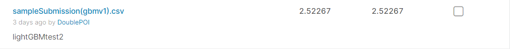
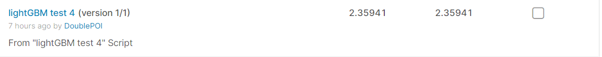

# [旧金山犯罪分类预测模型研究]9、传统机器学习（其二）

这一篇对lightGBM进行调参

导入数据并设置一个初始参数：

```python
import numpy as np
import pandas as pd
import lightgbm as lgb

train_features = np.load('./data/train_features.npy')
train_labels = np.load('./data/train_labels.npy')
test_features = np.load('./data/test_features.npy')

data_train = lgb.Dataset(train_features, label = train_labels)

num_inputs = 21
num_outputs = 39

params = {
    'boosting': 'gbdt', 
    'objective': 'multiclass',
    'metrics' : 'multi_logloss',
    'num_class': num_outputs,
    'verbosity': 1,                   #以上不再调整
    'max_depth': 6,
    'num_leaves': 50,                 #常用数值，备调，step2
    'min_data_in_leaf' : 20,          #默认数值，备调，step3
    'feature_fraction': 0.8,          #常用数值，备调，step4
    'learning_rate': 0.1,             #默认数值，备调，step5
    }
```

## 定一个合适的num_boost_round


```python
results = lgb.cv(params,
                 data_train,
                 num_boost_round = 1000,
                 nfold = 3,
                 shuffle = True,
                 early_stopping_rounds = 40,
                 verbose_eval = 100)
print('best num_boost_round:', len(results['multi_logloss-mean']))
print('last mean:', results['multi_logloss-mean'][-1])
print('last stdv:', results['multi_logloss-stdv'][-1])
```

得到输出：

[100]	cv_agg's multi_logloss: 2.39575 + 0.00471342

[200]	cv_agg's multi_logloss: 2.3862 + 0.00131608

best num_boost_round: 214

last mean: 2.379645842199627

last stdv: 0.0024214570330422813

进行一次提交：

```python
params = {
    'boosting': 'gbdt', 
    'objective': 'multiclass',
    'metrics' : 'multi_logloss',
    'num_class': num_outputs,
    'verbosity': 1,                   #以上不再调整
    'max_depth': 6,
    'num_leaves': 50,                 #常用数值，备调，step2
    'min_data_in_leaf' : 20,          #默认数值，备调，step3
    'feature_fraction': 0.8,          #常用数值，备调，step4
    'learning_rate': 0.1,             #默认数值，备调，step5
    }
gbm = lgb.train(params, data_train, num_boost_round = 214)
gbm.save_model('../working/gbm(v1).txt')
testResult = gbm.predict(test_features)
sampleSubmission = pd.read_csv('../input/sf-crime/sampleSubmission.csv.zip')
Result_pd = pd.DataFrame(testResult,
                         index=sampleSubmission.index,
                         columns=sampleSubmission.columns[1:])
Result_pd.to_csv('../working/sampleSubmission(gbmv1).csv', index_label='Id')
```

训练集误差为：



## 调整max_depth和num_leaves


```python
for max_depth in range(3,8,2):
    for num_leaves in range(20, 70, 40):
        params['max_depth'] = max_depth
        params['num_leaves'] = num_leaves
        print('max_depth = %d , num_leaves = %d' %
              (params['max_depth'] , params['num_leaves']))
        results = lgb.cv(params,
                         data_train,
                         num_boost_round = 214,
                         nfold = 3,
                         shuffle = True,
                         early_stopping_rounds = 40)
        print('last mean:', results['multi_logloss-mean'][-1])
        print('last stdv:', results['multi_logloss-stdv'][-1])
```

得到输出：

max_depth = 3 , num_leaves = 20

last mean: 2.4220655707599197

last stdv: 0.0065027223149882645

max_depth = 3 , num_leaves = 60

last mean: 2.4220655707599197

last stdv: 0.0065027223149882645

max_depth = 5 , num_leaves = 20

last mean: 2.3893025015374247

last stdv: 0.003230273930546185

max_depth = 5 , num_leaves = 60

last mean: 2.387051839466166

last stdv: 0.009956365968283616

max_depth = 7 , num_leaves = 20

last mean: 2.577312549960696

last stdv: 0.016977703463318776

max_depth = 7 , num_leaves = 60

last mean: 2.4587145258610956

last stdv: 0.008400881474445983
    

接着细调，得到表格：

max_depth | num_leaves | loss-mean | loss-stdv
:-: | :-: | :-: | :-:
3 | 20 | 2.422065570759919 | 0.00650272231498826
3 | 60 | 2.422065570759919 | 0.00650272231498826
5 | 10 | 2.498089755081343 | 0.00046375983534336
5 | 20 | **2.389302501537424** | 0.00323027393054618
5 | 30 | **2.387804162075646** | 0.00873396137583386
5 | 40 | **2.387051839466166** | 0.00995636596828361
5 | 50 | **2.387051839466166** | 0.00995636596828361
5 | 60 | **2.387051839466166** | 0.00995636596828361
6 | 35 | 2.489192248261775 | 0.01080413767862259
6 | 38 | **2.391581625639863** | 0.00205136536613059
6 | 39 | 2.428458342356551 | 0.01570288199424567
6 | 40 | **2.386492533335521** | 0.00439650664434712
6 | 41 | 2.422221139954483 | 0.00700068398148187
6 | 42 | **2.394176419837988** | 0.00588477265722335
6 | 45 | 2.433776088235827 | 0.02315130230634282
6 | 48 | **2.388492100373433** | 0.00490089211441510
6 | 49 | 2.440617942865168 | 0.03795938818655425
6 | 50 | **2.379645842199627** | 0.00242145703304228
**6** | **51** | **2.379316580570886** | 0.00161492136855090
6 | 52 | 2.432784516485041 | 0.00751501142645511
6 | 55 | 2.485440981089821 | 0.00208699822234836
7 | 20 | 2.577312549960696 | 0.01697770346331877
7 | 60 | 2.458714525861095 | 0.00840088147444598

确定max_depth取值为6，num_leaves取值为51。

## 调整min_data_in_leaf

```python
for  min_data_in_leaf in (10, 30):
    params['min_data_in_leaf'] =  min_data_in_leaf
    print('min_data_in_leaf = %d' % (params['min_data_in_leaf']))
    #print(params)
    #'''
    results = lgb.cv(params,
                     data_train,
                     num_boost_round = 214,
                     nfold = 3,
                     shuffle = True,
                     early_stopping_rounds = 40,
                     verbose_eval = 100)
    print('last mean:', results['multi_logloss-mean'][-1])
    print('last stdv:', results['multi_logloss-stdv'][-1])
    #'''
```

得到输出：

min_data_in_leaf = 10

[100]	cv_agg's multi_logloss: 2.41101 + 0.00927644

last mean: 2.3988022363060515

last stdv: 0.008656683290247618

min_data_in_leaf = 30

[100]	cv_agg's multi_logloss: 2.39748 + 0.0100026

last mean: 2.383482452281396

last stdv: 0.0011820715015853234

最终得到表格：

min_data_in_leaf | loss-mean | loss-stdv
:-: | :-: | :-: 
10 | 2.398802236306051 | 0.008656683290247618
18 | 2.386981822669378 | 0.003385738976861327
19 | 2.395632364338063 | 0.002191965018621247
20 | **2.379316580570886** | **0.001614921368550909**
21 | 2.383561283453592 | 0.004011287921746836
22 | 2.472045824246667 | 0.010899544962079137
24 | 2.381952934797638 | 0.002575471097658755
25 | **2.375107782694854** | 0.004941879444657266
26 | **2.379177527088882** | 0.004678329123338282
28 | 2.424026943571746 | **0.001265288744226837**
30 | 2.383482452281396 | **0.001182071501585323**

确定min_data_in_leaf取值为25。

## 调整feature_fraction

同上方法，得到表格：

feature_fraction | loss-mean | loss-stdv
:-: | :-: | :-:
0.60 | 2.385215748483773 | 0.012141673640713
0.70 | 2.389174530713541 | 0.002666629435758
0.76 | 2.384927671009105 | 0.003871886355262
0.78 | 2.384927671009105 | 0.003871886355262
0.79 | 2.375107782694854 | 0.004941879444657
0.80 | 2.375107782694854 | 0.004941879444657
0.81 | 2.375107782694854 | 0.004941879444657
0.82 | 2.375107782694854 | 0.004941879444657
0.84 | 2.402827931259069 | 0.012815010197265
0.90 | 2.470756387332203 | 0.092283616674221

确定feature_fraction取值为0.79。

## 缩小learning_rate

```python
params = {
    'boosting': 'gbdt', 
    'objective': 'multiclass',
    'metrics' : 'multi_logloss',
    'num_class': num_outputs,
    'verbosity': 1,
    'max_depth': 6,
    'num_leaves': 51,
    'min_data_in_leaf' : 25,
    'feature_fraction': 0.79,
    'learning_rate': 0.01,
    }
results = lgb.cv(params,
                 data_train,
                 num_boost_round = 10000,
                 nfold = 3,
                 shuffle = True,
                 early_stopping_rounds = 100,
                 verbose_eval = 1000)
```

得到输出：


[1000]	cv_agg's multi_logloss: 2.37528 + 0.000758945

[2000]	cv_agg's multi_logloss: 2.35359 + 0.00105556

[3000]	cv_agg's multi_logloss: 2.34392 + 0.00133851

[4000]	cv_agg's multi_logloss: 2.33911 + 0.00148543

[5000]	cv_agg's multi_logloss: 2.33683 + 0.00160352

需要注意的是，直到5000轮迭代，仍然没有收敛，是手动终止的。

进行输出，由于计算资源不足，只训练2000轮：

```python
params = {
    'boosting': 'gbdt', 
    'objective': 'multiclass',
    'metrics' : 'multi_logloss',
    'num_class': num_outputs,
    'verbosity': 1,
    'device_type':'gpu',
    'gpu_platform_id':0,
    'gpu_device_id':0,
    'max_depth': 6,
    'num_leaves': 51,
    'min_data_in_leaf' : 25,
    'feature_fraction': 0.79,
    'learning_rate': 0.01,
    }
gbm = lgb.train(params, data_train, num_boost_round = 2000)
gbm.save_model('../working/gbm(v2).txt')
testResult = gbm.predict(test_features)
sampleSubmission = pd.read_csv('../input/sf-crime/sampleSubmission.csv.zip')
Result_pd = pd.DataFrame(testResult,
                         index=sampleSubmission.index,
                         columns=sampleSubmission.columns[1:])
Result_pd.to_csv('../working/sampleSubmission(gbmv2).csv', index_label='Id')
```

测试集误差：



可以看到，和上面第2000轮时的差值很小，可以猜测，若增大迭代次数，还能继续减小误差。
